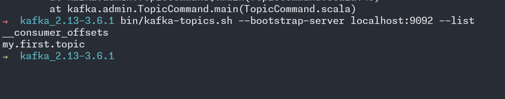
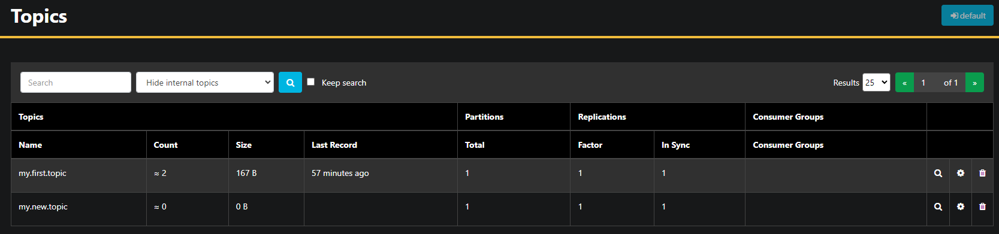
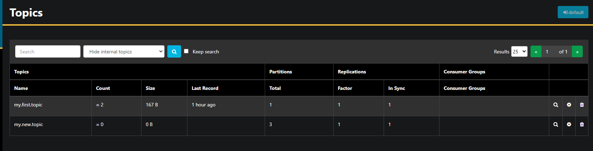
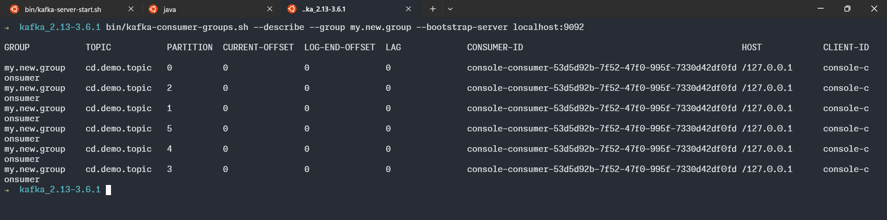
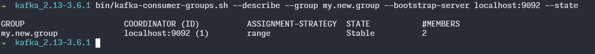
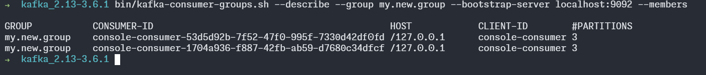

# SETUP

## Install

download the latest version of kafka from the official website and extract it to a directory of your choice.

<https://kafka.apache.org/downloads>

install latest version of java

```bash
sudo apt install openjdk-21-jdk
```

```bash
java -Dmicronaut.config.files=application.yml -jar akhq-0.24.0-all.jar
```

unzip the downloaded file

```bash
tar -xvf ../kafka_2.13-3.6.1.tgz
```

Generate the kafka cluster id

```bash
KAFKA_CLUSTER_ID="$(bin/kafka-storage.sh random-uuid)"
```

Create a directory for the kafka data

```bash
 bin/kafka-storage.sh format -t $KAFKA_CLUSTER_ID -c config/kraft/server.properties
```

start the kafka server

```bash
bin/kafka-server-start.sh config/kraft/server.properties
```

to stop the kafka server

```bash
bin/kafka-server-stop.sh
```

to see the list of topics

```bash
bin/kafka-topics.sh --list --bootstrap-server localhost:9092
```



__consumer_offsets is a topic that is used by kafka to store the offsets of the consumers.__

let's create a topic

```bash
bin/kafka-topics.sh --create --topic my.new.topic --bootstrap-server localhost:9092 --partitions 1 --replication-factor 1
```



to describe the topic

```bash
bin/kafka-topics.sh --describe --topic my.new.topic --bootstrap-server localhost:9092
```

let's change the number of partitions to 3

```bash
bin/kafka-topics.sh --alter --topic my.new.topic --bootstrap-server localhost:9092 --partitions 3
```



to delete a topic

```bash
bin/kafka-topics.sh --delete --topic my.new.topic --bootstrap-server localhost:9092
```

let's create a topic called cd.demo.topic with 6 partitions

```bash
bin/kafka-topics.sh --create --topic cd.demo.topic --bootstrap-server localhost:9092 --partitions 6 --replication-factor 1
```

let's list consumer groups

```bash
bin/kafka-consumer-groups.sh --list --bootstrap-server localhost:9092
```

let's create a consumer with a group id of my.new.group

```bash
bin/kafka-console-consumer.sh --topic cd.demo.topic --bootstrap-server localhost:9092 --group my.new.group
```

let's describe the consumer group

```bash
bin/kafka-consumer-groups.sh --describe --group my.new.group --bootstrap-server localhost:9092
```



to check the state of the consumer group

```bash
 kafka_2.13-3.6.1 bin/kafka-consumer-groups.sh --describe --group my.new.group --bootstrap-server localhost:9092 --state
```



let's check the members of the consumer group

```bash
bin/kafka-consumer-groups.sh --describe --group my.new.group --bootstrap-server localhost:9092 --members
```


